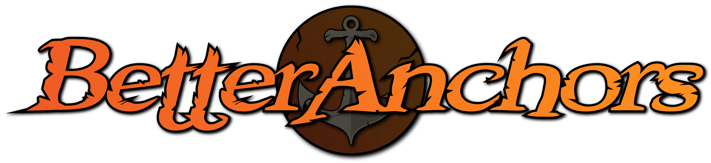

  

  BetterAnchors Provides a better way to anchor Weakauras!

## Features

With BetterAnchors, you can:

- **Intuitive and Flexible**: BetterAnchors allows you to anchor Weakauras in a more intuitive and flexible way, making it easier to customize your UI.
- **Precise Positioning**: With the grid overlay feature, you can position your anchors with precision, ensuring your UI elements are exactly where you want them.
- **Scale Adjustment**: The ability to set the scale of your anchors using a slider gives you more control over the size of your UI elements.
- **Monitor Support**: Whether you're using a standard or ultrawide monitor, BetterAnchors has got you covered.
- **Easy Reset**: If you ever need to start over, you can reset all anchor positions and scales to their default state with just a click.
- **Visibility Control**: The addon's minimap icon can be easily toggled on and off, allowing you to keep your minimap clutter-free.

## Chat Commands

- `/ba` or `/betteranchors`: Opens the BetterAnchors options menu.
- `/ba reset`: Resets all anchor positions and scales to their default state.
- '/ba minimap`: Toggles the minimap icon on and off.
- '/ba help`: Shows a list of ingame commands

## Anchor Frames

- **Player Circle**: The player circle is where circle auras are anchored.(usually debuffs that require you to spread out)
- **Player List**: The player list is for auras that require you to know your team mates debuffs (think of seed stacks on Fyrak)
- **Icons**: The Icons frame are for debuffs and buff that you get during an encounter.
- **Text Warnings**: Countdowns and player warnings are anchored here.
- **Map Frame**: The map frame anchors things like neltharian's map and smolderons map.
- **Cast Bars**: Anchors important casts during the encounter.
- **Large List**: The large list is primarly used for the larger raid leader lists.
- **Private Auras**: The private auras frame is for auras that are only visible to you.
- **Tank ICons**: Shows your tank debuffs and buffs.
- **Co-Tank Icons**: Shows your co-tanks debuffs and buffs.

# How to use BetterAnchors with your WA Packages
